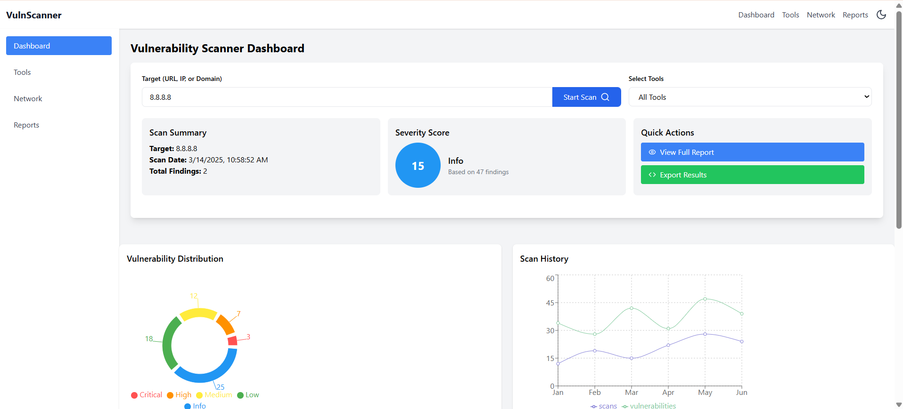

1. **Create a Script File**  
   - In your `my-react-app` folder, create a file called `generateReadme.js` (you can do this in VS Code by right-clicking in the Explorer > `New File`).

2. **Add This Code to `generateReadme.js`**  
   ```javascript
   const fs = require('fs');

   function generateReadme() {
     const content = `
# Vulnerability Scanner Dashboard

Welcome to the **Vulnerability Scanner Dashboard**! This is a fun React app you can run in VS Code to scan networks, find vulnerabilities, and see cool charts and a 3D map. It’s like a detective tool for checking websites or networks!

## What’s Inside?

- A dashboard to start scans and see results.
- Tools like Nmap, Nslookup, WhatWeb, Dirb, Gobuster, and DNS Recon.
- Awesome charts (pies and lines) for vulnerabilities.
- A 3D network map to see your scan in action.
- Dark mode for a comfy coding vibe.

## Dependencies (The Building Blocks)

These are the packages we need:

- **React**: Builds the app.
- **three**: Makes the 3D map.
- **framer-motion**: Adds smooth animations.
- **recharts**: Draws charts.
- **lucide-react**: Gives us icons (like shields!).
- **tailwindcss**: Makes styling easy.
- **postcss & autoprefixer**: Helps Tailwind work.

## How to Set It Up in VS Code

Let’s get this running in Visual Studio Code! Follow these baby steps:

1. **Open VS Code**  
   - Launch VS Code on your computer.

2. **Open Your Project Folder**  
   - Click \`File\` > \`Open Folder\` in VS Code.  
   - Pick the folder called \`my-react-app\` (or wherever your project lives).

3. **Open the Terminal in VS Code**  
   - Click \`Terminal\` > \`New Terminal\` at the top. A little window will pop up at the bottom.

4. **Go to Your Project Folder**  
   - In the terminal, type this and hit Enter:  
     \`\`\`bash
     cd my-react-app
     \`\`\`  
   - (If you’re already in the right folder, skip this!)

### Installing Dependencies

Now, let’s add all the packages the app needs:

5. **Install the Basics**  
   - Type this and press Enter to get React and core stuff:  
     \`\`\`bash
     npm install
     \`\`\`

6. **Add the Fun Packages**  
   - Run this to get the 3D, charts, icons, and animations:  
     \`\`\`bash
     npm install three framer-motion recharts lucide-react
     \`\`\`

7. **Set Up Tailwind (For Styling)**  
   - Install Tailwind and its helpers:  
     \`\`\`bash
     npm install -D tailwindcss postcss autoprefixer
     \`\`\`  
   - Create Tailwind config files:  
     \`\`\`bash
     npx tailwindcss init -p
     \`\`\`

### Running the App

8. **Start the App**  
   - Type this and hit Enter:  
     \`\`\`bash
     npm start
     \`\`\`  
   - Your browser should open to \`http://localhost:3000\`. If it doesn’t, just type that in your browser!

## HOME PAGE

    

## Using the App

- In the dashboard, type a URL or IP (like \`example.com\`).
- Click "Start Scan" and watch it work!
- Check out the charts, vulnerabilities, and 3D map.

## Troubleshooting in VS Code

- **Terminal Not Working?** Make sure you have Node.js installed (download it from nodejs.org if not).
- **Errors?** Double-check you’re in the \`my-react-app\` folder in the terminal.
- **Stuck?** Click the magnifying glass in VS Code’s sidebar to search for help!

Have fun scanning in VS Code! 🚀
     `;

     fs.writeFileSync('README.md', content.trim(), 'utf8');
     console.log('README.md has been generated successfully!');
   }

   generateReadme();